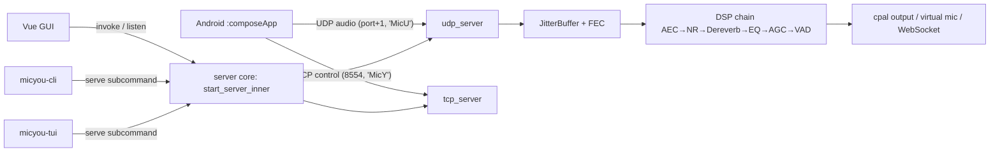

# Repository Guidelines

## Project Overview

MicYou turns Android devices into PC microphones. The Android client captures microphone audio and streams it over the network; the desktop app receives it and plays it back through a virtual mic device (VB-CABLE on Windows, BlackHole on macOS, PipeWire on Linux) or a browser via HTTPS. Two app surfaces share one wire protocol: a single-module Android app (`:composeApp`, Kotlin + Jetpack Compose + Material 3) and a desktop app (`tauri-app/`, Tauri 2 + Rust backend + Vue 3/Vite/Tailwind frontend). The desktop Rust core is reused by three frontends — GUI (Tauri), CLI (`micyou`), and TUI (`micyou-tui`) — which share the same server lifecycle, config files, and DSP settings.

## Architecture & Data Flow



- **Android**: single Activity (`MainActivity`) hosting a Compose tree (`App.kt` → `MobileHome`); no Fragments/Navigation. MVVM: `AudioStreamViewModel` (owns `AudioEngine` + mDNS discovery), `SettingsViewModel`, and `UpdateViewModel` are merged by a facade `MainViewModel` via `combine()` into one `AppUiState` StateFlow. `AudioEngine` captures via `AudioRecord`, applies a Kotlin DSP chain, and sends protobuf packets over TCP (control: connect/mute/ping/pong) + UDP (audio, port = TCP+1, FEC every 12 packets, magics `0x4D696359`/`0x4D696355`). A foreground `AudioService` keeps streaming alive; a Quick Settings tile starts/stops it.
- **Desktop backend** (`tauri-app/src-tauri` + `crates/`): the wire protocol is compiled by `micyou-protocol` (prost from `proto/network.proto`). `udp_server` validates/parses audio datagrams into an `mpsc(128)` channel; a dedicated audio thread reorders + FEC-recovers (jitter_buffer), decodes PCM (16/8/float/24-bit), runs the `micyou-audio` DSP chain (AEC pinned first, ONNX/RNNoise noise suppression), and plays via cpal. All events fan out through the `ServerEvents` trait — `TauriEventSink` (webview events), `CliEventSink` (log lines), `TuiEventSink` (throttled mpsc) — so CLI/TUI reuse the GUI's server core via `start_server_inner`/`stop_server_inner`. Three connection modes: **wifi** (LAN, mDNS `_micyou._tcp.`), **usb** (`adb reverse`), **web** (axum TLS WebSocket, feature-gated). GUI/CLI/TUI are mutually exclusive via a `mode.lock` file.
- **Shared config**: `~/.config/micyou/` (Linux) / `%APPDATA%\micyou` (Windows): `settings.json` (DSP), `server.json` (port 8554, webPort 8443, mode, bindAddress, outputDevice), `ui.json` (language/theme), `theme.json` (theme colors exported GUI → CLI/TUI). All three frontends read/write the same files.
- **Version flow**: root `gradle.properties` (`project.version`, `project.version.code`) is the single source of truth; `npm run sync-version` rewrites `tauri.conf.json`, `src-tauri/Cargo.toml`, and `package.json` (it does NOT touch the workspace root `Cargo.toml` — a known drift risk). It also runs automatically via `beforeBuildCommand` on every `tauri build`.

## Key Directories

| Path | Purpose |
|---|---|
| `composeApp/` | Android client module (`com.lanrhyme.micyou`); the only Gradle module |
| `composeApp/src/main/kotlin/com/lanrhyme/micyou/audio/` | `AudioEngine`, audio settings/source/metrics |
| `composeApp/src/main/kotlin/com/lanrhyme/micyou/network/` | Protobuf wire protocol, mDNS discovery, connection error mapping |
| `composeApp/src/main/kotlin/com/lanrhyme/micyou/{service,viewmodel,ui,settings,theme,util,update}` | Foreground service, ViewModels, Compose UI, prefs, theming, localization, update flow |
| `tauri-app/src/` | Vue 3 frontend: `features/` (connection, audio, theme, pocket), `shared/` (composables, components/ui, locales, assets) |
| `tauri-app/src-tauri/` | Tauri 2 Rust backend: `src/commands/`, `server.rs`, `app_config.rs`, tray, mode_lock, tcp/udp/web servers |
| `tauri-app/crates/micyou-protocol/` | protobuf wire format + magic constants (shared with Android `network/Protocol.kt`) |
| `tauri-app/crates/micyou-audio/` | cpal output engine, DSP chain (ONNX/RNNoise), loopback capture |
| `tauri-app/crates/micyou-cli/`, `micyou-tui/` | CLI and TUI frontends reusing the GUI server core |
| `docs/` | FAQ stubs redirecting to micyou.top (full content preserved in HTML comments) |
| `.github/workflows/` | CI: development, release, pre-release, MirrorChyan uploads, opencode AI review |

## Development Commands

```bash
# Android debug/release APK (from repo root)
./gradlew :composeApp:assembleDebug
./gradlew :composeApp:assembleRelease

# Desktop frontend (from tauri-app/)
npm run dev            # Vite dev server, port 1420 (strict)
npm run build          # vue-tsc --noEmit && vite build — the only static type gate
npm run preview

# Tauri desktop app (GUI)
npm run tauri dev
npm run tauri build    # runs sync-version + npm run build first (beforeBuildCommand)

# Alternate frontends (Rust workspace, from tauri-app/)
cargo run -p micyou-cli -- serve        # CLI server (binary: micyou)
micyou settings get/set, chain list/set # CLI subcommands (clap)
cargo run -p micyou-tui                 # TUI frontend

# Version bump flow
# 1. edit gradle.properties (project.version / project.version.code)
# 2. npm run sync-version                # propagates to tauri.conf.json / Cargo.toml / package.json
```

There are **no** lint, format, or test scripts anywhere (no eslint/prettier/ktlint wiring).

## Code Conventions & Common Patterns

- **Localization**: user-facing strings never hardcoded. Android: `composeApp/src/main/res/values*/strings.xml` (base `values/` = English; also en, zh, zh-rTW, zh-rHK, plus easter eggs zh-rHD "hard mode", ca "cat speak"), languages registered in `util/Localization.kt` (`AppLanguage` enum). Desktop: `tauri-app/src/shared/locales/*.json` (en base, zh, zh-hk, zh-tw, zh-ss, cat, lzh), registered in `src/main.ts` i18n messages. **Adding/renaming a key requires updating every locale file.**
- **Android**: MVVM with a single `AppUiState` facade collected by UI; settings stored in SharedPreferences (`"android_mic_prefs"`), **not** DataStore; settings-as-enums (`AudioSettings.kt`); wire constants centralized in `util/Constants.kt` + `network/Protocol.kt`; state-driven dialogs instead of navigation.
- **Rust backend**: Tauri commands are `snake_case` in `invoke_handler`; long-lived state is `Arc`-wrapped inside `ServerState` (managed Tauri state); lifecycle serialized via `ServerLifecycleGate` + `CancellationToken`; audio/DSP settings use `serde` with `camelCase` field names; unit tests inline as `#[cfg(test)]` modules.
- **Vue frontend**: no Pinia — state lives in singleton composables (`useServer`, `useAudio`, `useTheme`, `useWindow`, `useTray`) instantiated in `App.vue` and passed via props/events; persistence via `@vueuse/core useStorage` with `micyou_*` localStorage keys. Backend calls: `invoke('snake_case_cmd', args)`; events: `listen('kebab-or-snake-event')` (e.g. `audio-level`, `device-connected`, `tray-action`). Every invoke is try/catch-wrapped with optimistic updates + rollback; connection errors funnel into `ConnectionErrorDialog` via `utils/connectionError.ts`.
- **Styling**: Tailwind utilities + Material 3 HSL CSS variables (8 themes × light/dark via `.dark` class); feature components use raw Tailwind, `src/shared/components/ui/*` use shadcn-vue/reka-ui primitives + `cva` variants; `cn() = twMerge(clsx(...))` from `@/shared/lib/utils`. Note: `components.json` (shadcn config) has **stale aliases** — the real paths are `src/shared/components` and `src/shared/lib/utils`.
- **Versioning**: bump only `gradle.properties`; never hand-edit `tauri.conf.json`/`Cargo.toml`/`package.json` versions.
- **Communication**: ALWAYS use Chinese (中文) for code reviews, issue comments, pull request comments, and any other user-facing communication.

## Important Files

| File | Role |
|---|---|
| `gradle.properties` | Version source of truth (`project.version`, `project.version.code`) — gitignored but required by CI |
| `gradle/libs.versions.toml` | All Android dependency/SDK versions (AGP, Kotlin, compileSdk 36, minSdk 24, targetSdk 36) |
| `composeApp/build.gradle.kts` | Android module config; release signing gated on `ANDROID_KEYSTORE_*` env vars |
| `composeApp/src/main/kotlin/com/lanrhyme/micyou/MainActivity.kt`, `App.kt` | Android entry points |
| `composeApp/src/main/kotlin/com/lanrhyme/micyou/audio/AudioEngine.kt` | Core streaming engine (capture → DSP → TCP/UDP transport) |
| `composeApp/src/main/kotlin/com/lanrhyme/micyou/viewmodel/MainViewModel.kt` | UI state facade; app-wide state enums |
| `composeApp/src/main/kotlin/com/lanrhyme/micyou/network/Protocol.kt` | Wire protocol (must stay in sync with `micyou-protocol`) |
| `composeApp/src/main/kotlin/com/lanrhyme/micyou/util/Localization.kt` | `AppLanguage` enum; locale switching |
| `tauri-app/package.json` | npm scripts (dev/build/tauri/sync-version); version synced from gradle.properties |
| `tauri-app/sync-version.js` | Version propagation script (also `beforeBuildCommand`) |
| `tauri-app/src-tauri/tauri.conf.json` | Tauri app config (window, bundle targets, beforeBuildCommand) |
| `tauri-app/src-tauri/src/lib.rs` | Backend entry; module list + ~40 commands in `invoke_handler` |
| `tauri-app/src-tauri/src/commands/system.rs` | `start_server`/`start_server_inner` — shared server lifecycle |
| `tauri-app/src-tauri/src/app_config.rs` | Shared config load/save (`settings.json`, `server.json`, `ui.json`, `theme.json`) |
| `tauri-app/src-tauri/src/events.rs` | `ServerEvents` trait decoupling server core from Tauri/CLI/TUI |
| `tauri-app/src/main.ts` | Frontend entry; i18n registration; hash-based multi-window routing |
| `tauri-app/src/App.vue` | Main window (full + pocket modes), wires all composables |
| `tauri-app/crates/micyou-protocol/proto/network.proto` | Wire format source (prost-compiled) |
| `tauri-app/crates/micyou-audio/src/dsp.rs` | DSP settings struct + `DspProcessor` |

## Runtime/Tooling Preferences

- **Android**: JDK 21 (Java 11 bytecode target), Gradle 9.5.0 wrapper, AGP 9.3.1, Kotlin 2.4.10, compileSdk/targetSdk 36, minSdk 24, build-tools 36.1.0. Optional build-time config in `local.properties`: `AIFADIAN_API_TOKEN`, `AIFADIAN_USER_ID`.
- **Desktop**: Node 22 + npm (package-lock.json committed; CI uses `npm ci --include=dev`); Rust stable (edition 2021) via cargo; Tauri CLI 2 (`npx @tauri-apps/cli`); Vite dev server fixed at port 1420 with `TAURI_DEV_HOST` for HMR.
- **Release signing**: all four of `ANDROID_KEYSTORE_PATH`, `ANDROID_KEYSTORE_PASSWORD`, `ANDROID_KEY_ALIAS`, `ANDROID_KEY_PASSWORD` required, else release builds are unsigned. CI uses `ANDROID_KEYSTORE_BASE64`.
- **VS Code**: extensions.json recommends Volar, tauri-vscode, rust-analyzer. `.prettierrc` exists (2-space, singleQuote, printWidth 100) but no formatter is wired into scripts.
- **Known oddities**: `gradle.properties` and `gradle/wrapper/gradle-wrapper.properties` are gitignored but required by CI; `composeApp/micyou.conf` is a gitignored leftover with zero code references; `docs/FAQ*.md` are redirect stubs (content lives at micyou.top).

## Testing & QA

- **Tests are minimal by design.** Evidence: no `src/test`/`src/androidTest` in `composeApp` (kotlin-test in the version catalog is unused); no integration test dirs in the Rust workspace. The only Rust unit tests are inline `#[cfg(test)]` modules in 9 `src-tauri` files plus `micyou-audio/src/dsp.rs` (server, audio_stream, udp_server, tcp_server, jitter_buffer, stats, tray, mode_lock, commands/system); `micyou-protocol`, `micyou-cli`, and `micyou-tui` have zero tests.
- **Run Rust tests**: `cargo test` from `tauri-app/` (workspace).
- **Static checks**: the only automated gate is `vue-tsc --noEmit` inside `npm run build`. There is no lint/format automation.
- **CI** (`.github/workflows/`): `development.yml` builds the debug APK + Tauri packages on Windows/macOS/Linux for push/PR; `release.yml`/`pre-release.yml` build release artifacts and publish GitHub/MirrorChyan releases. Android CI steps run with `continue-on-error: true` and releases do not depend on the Android job — Android failures never block releases. `opencode.yml` runs an AI code review (Chinese prompt) on PR comments.
- **QA expectation**: manual end-to-end verification of the audio path (phone → server → virtual mic) is the de facto pipeline; keep changes build-green (`assembleDebug` + `npm run build`) and preserve `#[cfg(test)]` conventions for new Rust logic.
