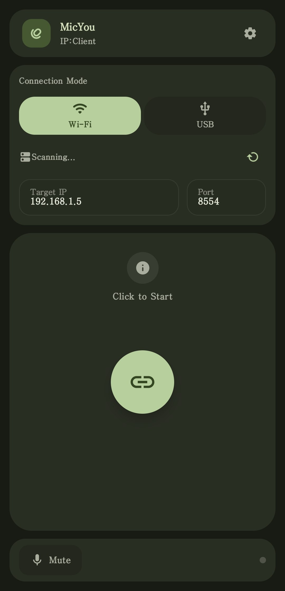
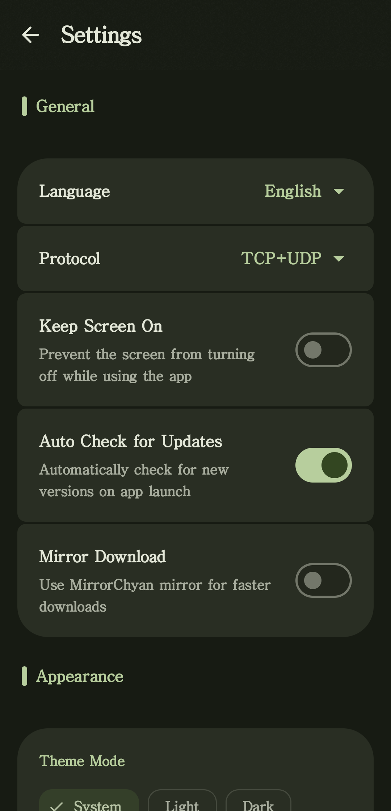
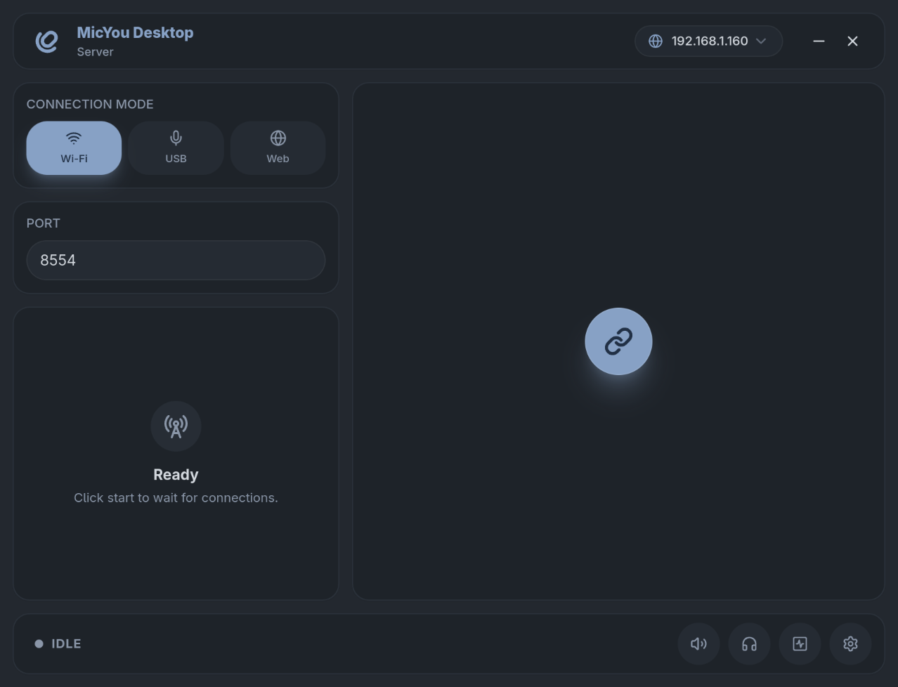
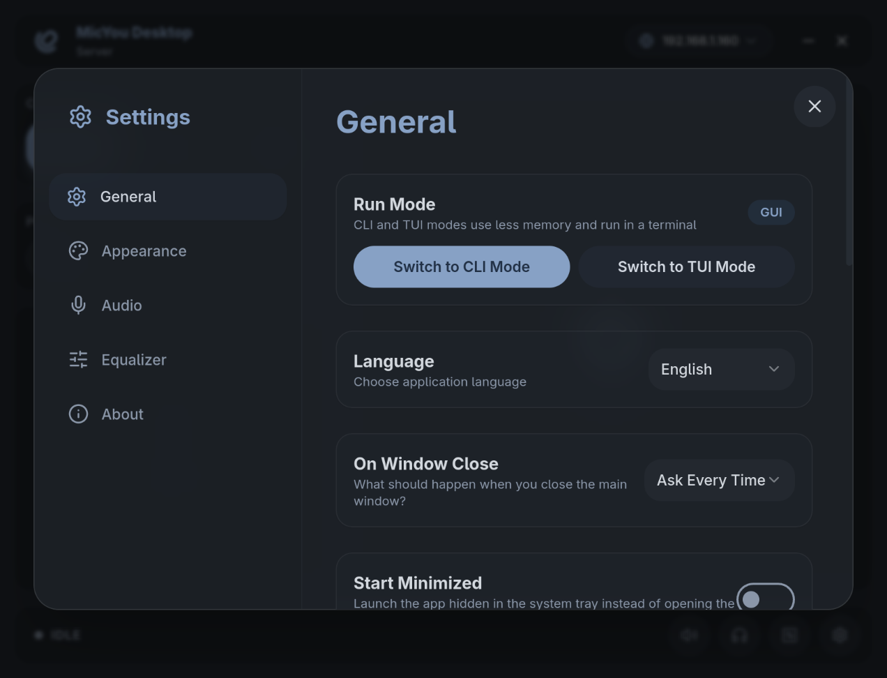

  
  <h1>MicYou</h1>
  
  

   

  
 

  <a href="./README_zh-cn.md">简体中文</a> | <a href="./README_zh-tw.md">繁體中文</a> | <b>English</b>

  
  
  

  <h6>Support Me</h6>

  

  MicYou turns your phone into a high-quality microphone for your PC.

  Native Android client · Windows / Linux / macOS desktop server · Wi-Fi / USB / Web

## Features

- Stream from the Android app over Wi-Fi or USB (ADB), or use Web mode directly from a mobile browser by scanning a QR code.
- Run the desktop server on Windows, Linux, and macOS with a full GUI, a low-overhead CLI, or an interactive TUI dashboard.
- Configure a processing pipeline with AI and traditional noise suppression, acoustic echo cancellation (AEC), dereverberation, equalizer, amplification, automatic gain control (AGC), and voice activity detection (VAD).
- Inspect audio level, bitrate, latency, jitter, packet loss, and buffer status; mute or monitor incoming audio at any time.
- Route audio through VB-CABLE on Windows, PipeWire on Linux, or BlackHole on macOS for use in calls, games, streaming, and recording apps.
- Customize Material 3 interfaces with light/dark themes, dynamic colors, custom backgrounds, desktop pocket mode, system tray controls, and multiple languages.
- Share connection, DSP, language, and theme preferences between the desktop GUI, CLI, and TUI.

## Screenshots

### Android App
|                        Main Screen                        |                           Settings                            |
|:---------------------------------------------------------:|:-------------------------------------------------------------:|
|  |  |

### Desktop App
|                         Main Screen                          |                              Settings                               |
|:------------------------------------------------------------:|:-------------------------------------------------------------------:|
|  |  |

## Getting Started

1. Download the Android APK and the desktop package for your operating system from [GitHub Releases](https://github.com/LanRhyme/MicYou/releases).
2. Set up a virtual microphone for your platform by following the [Quick Start guide](https://micyou.top/en/docs/quick-start).
3. Choose a connection method:
   - Wi-Fi: Keep the phone and PC on the same network, then select Wi-Fi on both apps.
   - USB: Enable USB debugging, connect the phone with a data cable, then select USB on both apps.
   - Web: Select Web on the desktop and scan the QR code with a mobile browser—no Android app is required.
4. Start streaming, then select the configured virtual microphone in your call, game, streaming, or recording app.

For platform-specific installation steps and troubleshooting, visit the [MicYou documentation](https://micyou.top/en/docs/quick-start).

## Technology

- Android: Kotlin, Jetpack Compose, Material 3
- Desktop: Tauri 2, Rust, Vue 3, Vite, Tailwind CSS
- Protocol and audio: A Rust backend and shared crates for transport, buffering, DSP, and virtual audio device integration

## Contributing

We welcome contributions of all kinds! Whether you want to report a bug, suggest a feature, help with translations, or contribute code, please check our [Contributing Guidelines](./CONTRIBUTING.md) to get started.

## Contributors

Made with [contrib.rocks](https://contrib.rocks).

## Star History

<a href="https://www.star-history.com/#LanRhyme/MicYou&type=date&legend=top-left">
 <picture>
   <source media="(prefers-color-scheme: dark)" srcset="https://api.star-history.com/svg?repos=LanRhyme/MicYou&type=date&theme=dark&legend=top-left" />
   <source media="(prefers-color-scheme: light)" srcset="https://api.star-history.com/svg?repos=LanRhyme/MicYou&type=date&legend=top-left" />
   
 </picture>
</a>

## Acknowledgments

Special thanks to [a2heng](https://github.com/a2heng) for open-sourcing [AEC7](https://github.com/a2heng/lightweight-aec-48k) and [PureVox](https://github.com/a2heng/lightweight-denoise-48k), which power MicYou's acoustic echo cancellation and AI noise suppression.

Special thanks to [CQU Open Source Software Mirror](https://mirrors.cqu.edu.cn/) for providing a mirror download service for this project.

Special thanks to [MirrorChyan](https://mirrorchyan.com/en/get-start) for providing a high-speed mirror download service for this project.

Special thanks to all the [contributors](https://github.com/LanRhyme/MicYou/graphs/contributors) for helping to make the project even better.
