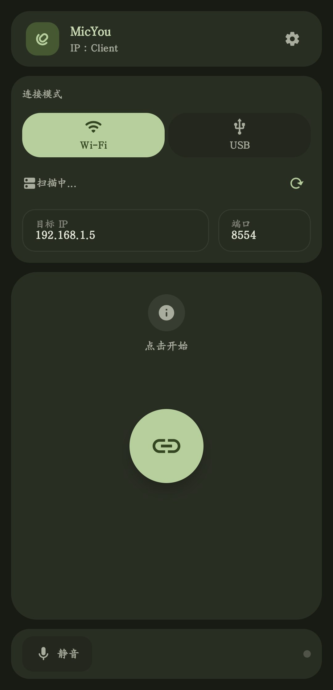
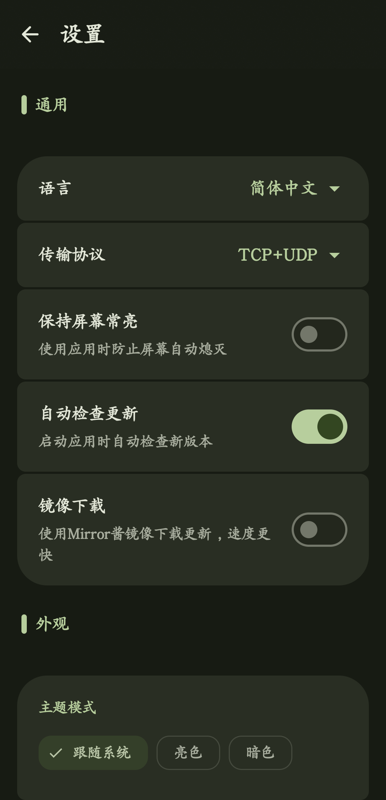
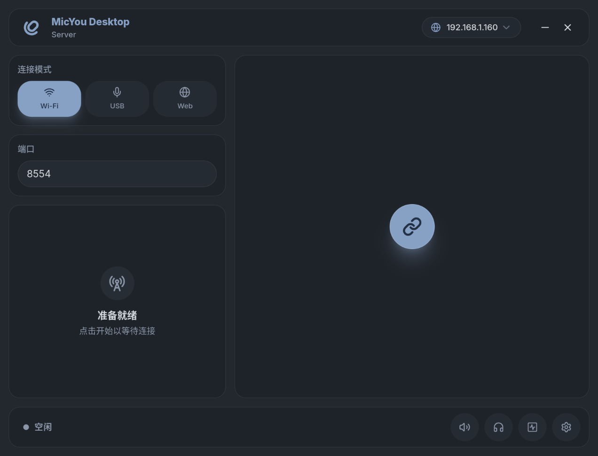
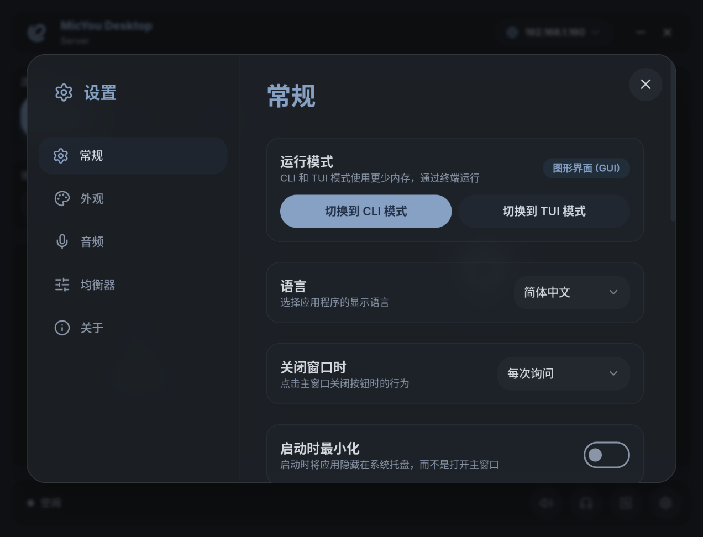

  
  <h1>MicYou</h1>
  
  

   
   

  
 

  <b>简体中文</b> | <a href="./README_zh-tw.md">繁體中文</a> | <a href="./README.md">English</a>

  
  
  

  <h6>赞助我</h6>

  

  MicYou 可将手机变为高质量的 PC 麦克风。

  原生 Android 客户端 · Windows / Linux / macOS 桌面端 · Wi-Fi / USB / Web

## 主要功能

- Android 客户端支持 Wi-Fi 和 USB (ADB)；Web 模式可通过二维码直接连接手机浏览器，无需安装客户端
- 桌面端支持 Windows、Linux 和 macOS，并提供完整 GUI、低占用 CLI 与交互式 TUI 仪表盘
- 可配置包含 AI 与传统降噪、声学回声消除 (AEC)、去混响、均衡器、放大、自动增益控制 (AGC) 和语音活动检测 (VAD) 的音频处理链
- 可实时查看音量、比特率、延迟、抖动、丢包率和缓冲区状态，并随时静音或监听输入音频
- 通过 Windows 的 VB-CABLE、Linux 的 PipeWire 或 macOS 的 BlackHole，将手机音频用于通话、游戏、直播与录音软件
- 支持 Material 3、深浅色主题、动态取色、自定义背景、桌面袖珍模式、系统托盘控制和多语言界面
- 桌面端 GUI、CLI 与 TUI 共用连接、DSP、语言和主题配置

## 软件截图

### Android 客户端
|                            主界面                            |                              设置                               |
|:---------------------------------------------------------:|:-------------------------------------------------------------:|
|  |  |

### 桌面端
|                              主界面                               |                                  设置                                   |
|:-----------------------------------------------------------------:|:-----------------------------------------------------------------------:|
|  |  |

## 使用指南

1. 从 [GitHub Releases](https://github.com/LanRhyme/MicYou/releases) 下载 Android APK 和对应操作系统的桌面端安装包
2. 按照[快速开始指南](https://micyou.top/docs/quick-start)为电脑配置虚拟麦克风
3. 选择连接方式：
   - Wi-Fi：确保手机与电脑处于同一网络，并在两端选择 Wi-Fi 模式
   - USB：启用 USB 调试，通过数据线连接手机，并在两端选择 USB 模式
   - Web：在桌面端选择 Web 模式，再用手机浏览器扫描二维码，无需安装 Android 客户端
4. 启动音频传输，然后在通话、游戏、直播或录音软件中选择已配置的虚拟麦克风

更多平台安装步骤与故障排查，请查阅 [MicYou 官方文档](https://micyou.top/docs/quick-start)。

## 技术栈

- Android：Kotlin、Jetpack Compose、Material 3
- 桌面端：Tauri 2、Rust、Vue 3、Vite、Tailwind CSS
- 协议与音频：由 Rust 后端与共享 Crate 实现传输、缓冲、DSP 和虚拟音频设备集成

## 贡献指南

我们欢迎各种形式的贡献！无论是报告 Bug、提出功能建议、协助翻译还是贡献代码，都请参阅我们的 [贡献指南](./CONTRIBUTING_zh-cn.md) 以开始参与。

## 贡献者

Made with [contrib.rocks](https://contrib.rocks).

## Star History

<a href="https://www.star-history.com/#LanRhyme/MicYou&type=date&legend=top-left">
 <picture>
   <source media="(prefers-color-scheme: dark)" srcset="https://api.star-history.com/svg?repos=LanRhyme/MicYou&type=date&theme=dark&legend=top-left" />
   <source media="(prefers-color-scheme: light)" srcset="https://api.star-history.com/svg?repos=LanRhyme/MicYou&type=date&legend=top-left" />
   
 </picture>
</a>

## 致谢

特别感谢 [a2heng](https://github.com/a2heng) 开源 [AEC7](https://github.com/a2heng/lightweight-aec-48k) 与 [PureVox](https://github.com/a2heng/lightweight-denoise-48k)，为 MicYou 提供声学回声消除与 AI 降噪能力。

特别感谢 [重庆大学开源软件镜像站](https://mirrors.cqu.edu.cn/) 为本项目提供镜像下载服务。

特别感谢 [Mirror 酱](https://mirrorchyan.com/zh/get-start) 为本项目提供高速镜像下载服务。

特别感谢所有的 [贡献者](https://github.com/LanRhyme/MicYou/graphs/contributors) 你们让项目变得更好。
