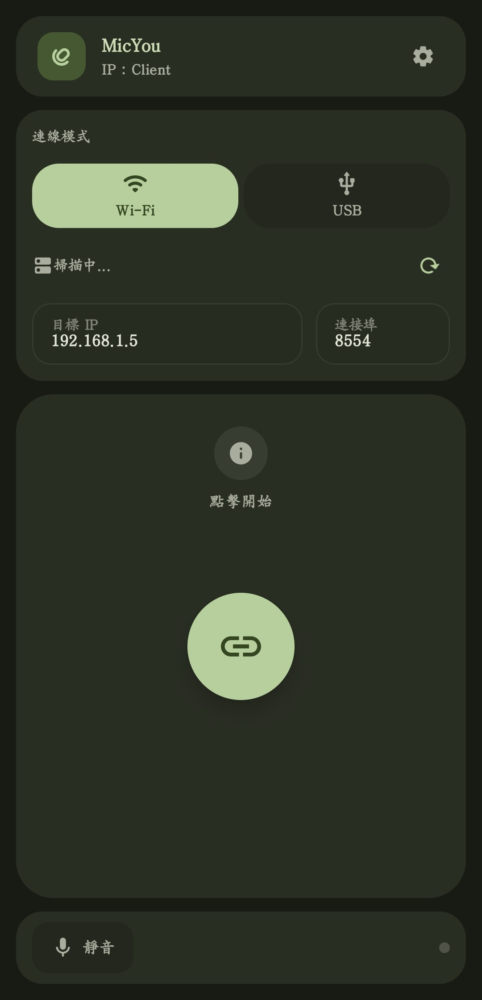
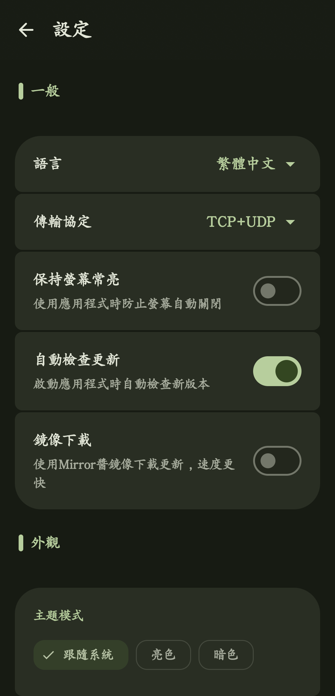
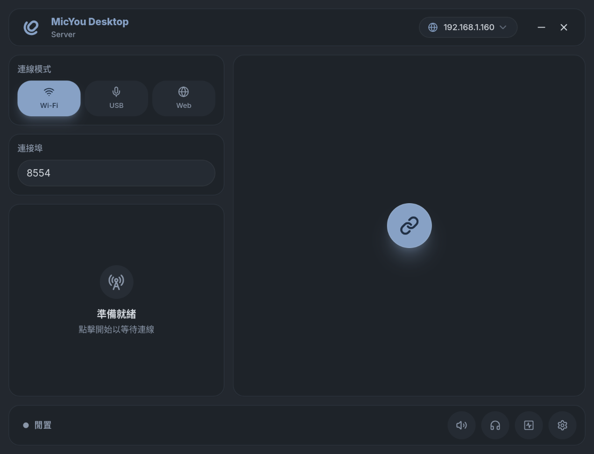
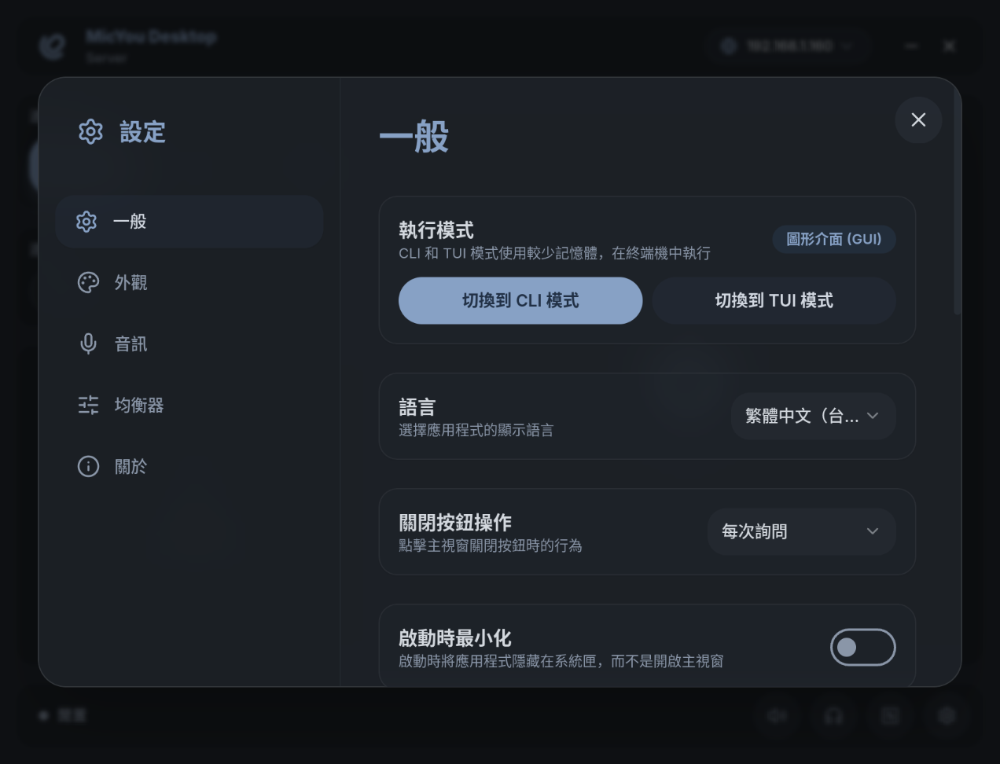

  
  <h1>MicYou</h1>
  
  

   

  
  

  <a href="./README_zh-cn.md">简体中文</a> | <b>繁體中文</b> | <a href="./README.md">English</a>

  
  
  

  <h6>贊助我</h6>

  

  MicYou 可將手機變為高品質的 PC 麥克風。

  原生 Android 客戶端 · Windows / Linux / macOS 桌面端 · Wi-Fi / USB / Web

## 主要功能

- Android 客戶端支援 Wi-Fi 與 USB (ADB)；Web 模式可透過 QR Code 直接連接手機瀏覽器，無需安裝客戶端
- 桌面端支援 Windows、Linux 與 macOS，並提供完整 GUI、低資源占用 CLI 及互動式 TUI 儀表板
- 可設定包含 AI 與傳統降噪、聲學回聲消除 (AEC)、去混響、等化器、放大、自動增益控制 (AGC) 及語音活動偵測 (VAD) 的音訊處理鏈
- 可即時查看音量、位元率、延遲、抖動、封包遺失率及緩衝區狀態，並隨時靜音或監聽輸入音訊
- 透過 Windows 的 VB-CABLE、Linux 的 PipeWire 或 macOS 的 BlackHole，將手機音訊用於通話、遊戲、直播與錄音軟體
- 支援 Material 3、深淺色主題、動態取色、自訂背景、桌面袖珍模式、系統匣控制及多語言介面
- 桌面端 GUI、CLI 與 TUI 共用連線、DSP、語言及主題設定

## 軟體截圖

### Android 客戶端
|                            主畫面                             |                           設定                               |
|:-----------------------------------------------------------:|:-------------------------------------------------------------:|
|  |  |

### 桌面端
|                              主畫面                               |                                  設定                                   |
|:-----------------------------------------------------------------:|:-----------------------------------------------------------------------:|
|  |  |

## 使用說明

1. 從 [GitHub Releases](https://github.com/LanRhyme/MicYou/releases) 下載 Android APK 及對應作業系統的桌面端安裝套件
2. 按照[快速開始指南](https://micyou.top/zh-TW/docs/quick-start)為電腦設定虛擬麥克風
3. 選擇連線方式：
   - Wi-Fi：確保手機與電腦位於同一網路，並在兩端選擇 Wi-Fi 模式
   - USB：啟用 USB 偵錯，透過資料線連接手機，並在兩端選擇 USB 模式
   - Web：在桌面端選擇 Web 模式，再用手機瀏覽器掃描 QR Code，無需安裝 Android 客戶端
4. 啟動音訊傳輸，然後在通話、遊戲、直播或錄音軟體中選擇已設定的虛擬麥克風

更多平台安裝步驟與疑難排解，請參閱 [MicYou 官方文件](https://micyou.top/zh-TW/docs/quick-start)。

## 技術堆疊

- Android：Kotlin、Jetpack Compose、Material 3
- 桌面端：Tauri 2、Rust、Vue 3、Vite、Tailwind CSS
- 協定與音訊：由 Rust 後端與共用 Crate 實作傳輸、緩衝、DSP 及虛擬音訊裝置整合

## 貢獻指南

我們歡迎各種形式的貢獻！無論是回報 Bug、提出功能建議、協助翻譯還是貢獻程式碼，都請參閱我們的 [貢獻指南](./CONTRIBUTING_zh-tw.md) 以開始參與。

## 貢獻者

Made with [contrib.rocks](https://contrib.rocks).

## Star History

<a href="https://www.star-history.com/#LanRhyme/MicYou&type=date&legend=top-left">
 <picture>
   <source media="(prefers-color-scheme: dark)" srcset="https://api.star-history.com/svg?repos=LanRhyme/MicYou&type=date&theme=dark&legend=top-left" />
   <source media="(prefers-color-scheme: light)" srcset="https://api.star-history.com/svg?repos=LanRhyme/MicYou&type=date&legend=top-left" />
   
 </picture>
</a>

## 致謝

特別感謝 [重慶大學開源軟體鏡像站](https://mirrors.cqu.edu.cn/) 為本專案提供鏡像下載服務。

特別感謝 [Mirror 醬](https://mirrorchyan.com/zh/get-start) 為本專案提供高速鏡像下載服務。

特別感謝所有的 [貢獻者](https://github.com/LanRhyme/MicYou/graphs/contributors) 你們讓專案變得更好。
